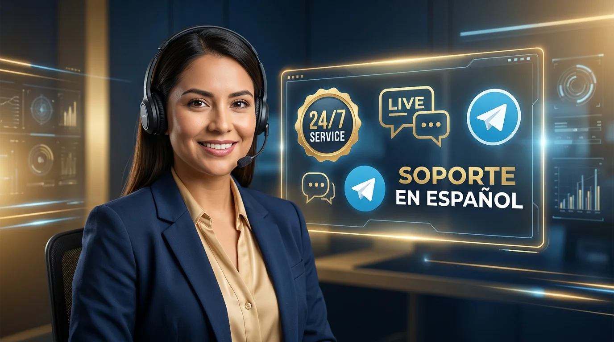
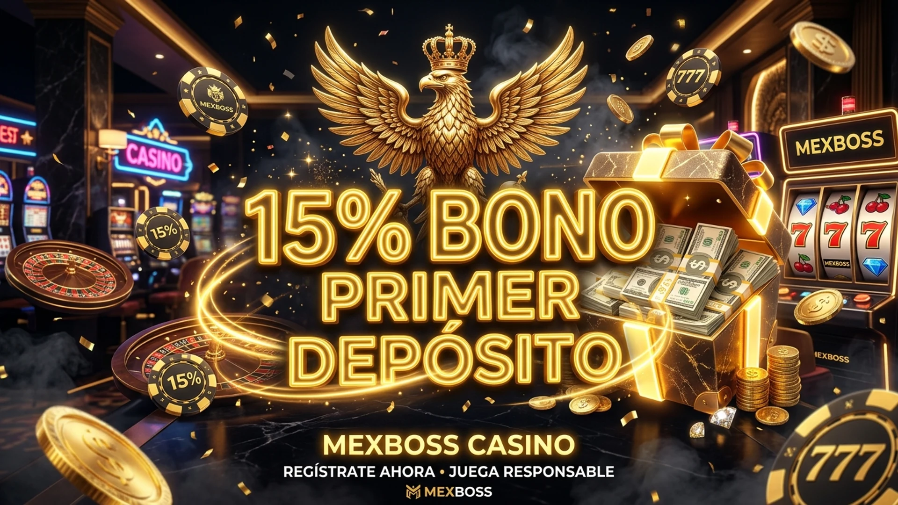
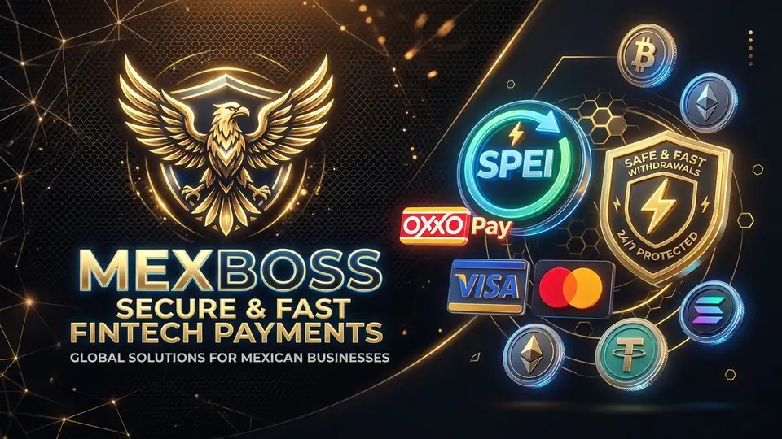
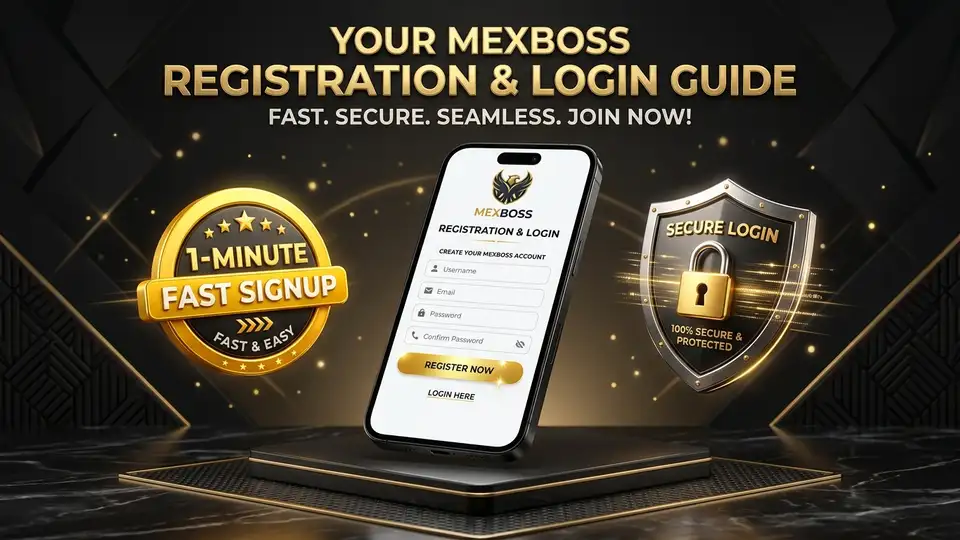

# BỘ TÀI LIỆU CONTENT CHUẨN SEO 100/100 RANK MATH: "SOPORTE EN MEXBOSS 2026"

---

## ⚙️ 1. THIẾT LẬP CÁC Ô TRÊN TOOL RANK MATH SEO (QUAN TRỌNG NHẤT)

| Mục trên Rank Math | Nội dung cần điền (Copy & Paste chính xác) | Mục đích chấm điểm Rank Math |
| :--- | :--- | :--- |
| **Palabra clave objetivo** *(Focus Keyword)* | `Soporte en Mexboss` | Điểm bắt đầu tính toán toàn bộ thuật toán Rank Math |
| **Palabras clave secundarias** | `atención al cliente Mexboss 24/7, chat en vivo Mexboss español, contacto oficial Mexboss Telegram, ayuda para jugadores Mexboss, servicio al cliente casino México` | Kéo traffic từ các từ khóa phụ (LSI) |
| **Título SEO** *(Bấm "Editar fragmento")* | `Soporte en Mexboss 2026: Atención al Cliente 24/7 en Vivo` | Chứa từ khóa NGAY ĐẦU CÂU + Chứa số (2026) + Từ kích thích (24/7, En Vivo) (~57 ký tự chuẩn) |
| **Descripción SEO** *(Bấm "Editar fragmento")* | `Centro oficial de soporte en Mexboss con atención al cliente 24/7 en México. Resolvemos tus dudas en menos de 45 segundos vía chat en vivo y Telegram en español.` | Chứa từ khóa + Độ dài chuẩn ~158 ký tự |
| **URL / Slug** *(Bấm "Editar fragmento")* | `soporte-en-mexboss` | Khớp chính xác 100% từ khóa mục tiêu, xóa bỏ lỗi đỏ URL trên tool |

---

## 🖼️ 2. THIẾT LẬP ẢNH ĐẠI DIỆN (FEATURED IMAGE)
- **Tên file ảnh:** `atencion-al-cliente-soporte-24-7-mexboss-seo.webp`
- **Texto alternativo (Alt text):** `Soporte en Mexboss atención al cliente 24/7 y chat en vivo en México` *(Bắt buộc chứa từ khóa)*
- **Título:** `Soporte en Mexboss Oficial`
- **Leyenda (Caption):** `Canales oficiales de soporte en Mexboss y atención al cliente en vivo 24/7 en español.`

---

## 📝 3. NỘI DUNG BÀI VIẾT (COPY TOÀN BỘ PHẦN BÊN DƯỚI DÁN VÀO WORDPRESS CODE EDITOR)

```html
<h1>Soporte en Mexboss: Atención al Cliente y Asistencia Personalizada 24/7 en Español México</h1>

<figure>
    
    <figcaption>Canales oficiales de soporte en Mexboss y atención al cliente en vivo 24/7 en español.</figcaption>
</figure>

<h2 id="canales-contacto">Soporte en Mexboss: Vías Oficiales de Comunicación y Contacto Directo</h2>

<p>El servicio oficial de <strong>soporte en Mexboss</strong> constituye el pilar fundamental sobre el cual se construye la confianza inquebrantable de nuestra comunidad en México. Ya sea que necesites orientación para activar tu bono de bienvenida, asistencia técnica para verificar tu cuenta o seguimiento detallado a un retiro bancario, nuestro equipo de atención personalizada está listo para asistirte las 24 horas del día, los 365 días del año.</p>

<p>Ponemos a tu disposición múltiples vías de comunicación directa, atendidas exclusivamente por especialistas humanos capacitados que comprenden a la perfección las necesidades y el lenguaje de los jugadores mexicanos, garantizando soluciones rápidas sin respuestas automáticas frustrantes.</p>

<p>Cualquiera que sea el dispositivo desde el que juegues (computadora, tableta o smartphone), tienes acceso a un botón de contacto que te enlaza en segundos con nuestro centro de operaciones.</p>

<p>Nos diferenciamos de la competencia por erradicar los bots genéricos; al comunicarte con el <strong>soporte en Mexboss</strong>, siempre serás atendido por una persona real con la capacidad operativa de resolver tu solicitud al instante.</p>

<h2 id="chat-en-vivo">Chat en Vivo 24/7: Atención Humana Inmediata</h2>

<p>El <strong>Chat en Vivo en el portal oficial</strong> representa el canal más ágil del <strong>soporte en Mexboss</strong> por su inmediatez y eficacia operativa:</p>

<ul>
  <li><strong>Disponibilidad Permanente:</strong> Operativo las 24 horas del día, los 7 días de la semana, tanto en nuestra plataforma web como en la <a href="/descargar-app/">aplicación móvil de Mexboss</a>.</li>
  <li><strong>Tiempo de Respuesta Récord:</strong> Nuestro tiempo de respuesta promedio es de menos de 45 segundos, conectándote de inmediato con un asesor humano en español de México.</li>
  <li><strong>Resolución en Primer Contacto:</strong> Más del 92% de las solicitudes presentadas al <strong>soporte en Mexboss</strong> se resuelven satisfactoriamente durante la misma sesión de chat sin tickets demorados.</li>
  <li><strong>Soporte Multimedia:</strong> Puedes adjuntar capturas de pantalla o comprobantes de transferencias bancarias directamente en la ventana de chat para agilizar el diagnóstico.</li>
  <li><strong>Historial de Conversación:</strong> Tus consultas quedan guardadas en tu panel personal, permitiéndote revisar instrucciones previas en cualquier momento.</li>
  <li><strong>Evaluación de Calidad Inmediata:</strong> Al finalizar cada atención podrás calificar la calidad del servicio recibido, ayudándonos a elevar constantemente nuestros estándares.</li>
</ul>

<h2 id="telegram-redes">Comunidad Oficial en Telegram y Canales Digitales</h2>

<p>Para quienes prefieren la comodidad de las aplicaciones de mensajería instantánea en su celular, contamos con canales digitales dedicados:</p>

<ul>
  <li><strong>Canal Oficial de Telegram:</strong> Únete a nuestra comunidad para recibir asistencia personalizada, consultar anuncios de mantenimiento preventivo y enterarte de códigos de giros gratis y promociones de fin de semana.</li>
  <li><strong>Correo Electrónico de Soporte Formal:</strong> Ideal para consultas complejas, envío de documentación KYC de alta resolución o aclaraciones directas con el equipo de <strong>soporte en Mexboss</strong>: `soporte@mexboss.sh`, con respuesta garantizada en menos de 2 horas.</li>
  <li><strong>Redes Sociales Oficiales:</strong> Síguenos en nuestros perfiles oficiales verificados para participar en dinámicas semanales, sorteos de saldo y noticias del deporte mexicano.</li>
</ul>

<h2 id="asuntos-atendidos">Principales Asuntos Atendidos por Nuestro Equipo</h2>

<figure>
    
    <figcaption>Nuestro equipo de soporte te guía paso a paso para activar tus bonificaciones y giros gratis.</figcaption>
</figure>

<p>El personal técnico y los especialistas de <strong>soporte en Mexboss</strong> están altamente capacitados para resolver con destreza cualquier situación operativa:</p>

<ul>
  <li><strong>Depósitos y Recargas OXXO:</strong> Validación inmediata de comprobantes y acreditación de transferencias bancarias en caso de demoras del sistema.</li>
  <li><strong>Seguimiento a Retiros SPEI:</strong> Monitoreo del estado de transferencias electrónicas hacia tu banco nacional (BBVA, Banorte, Nu, Santander, Banco Azteca).</li>
  <li><strong>Activación y Requisitos de Bonos:</strong> Asesoría personalizada sobre el cumplimiento de rollovers del seguro del 15% y promociones de la sección de <a href="/promociones/">bonos de Mexboss</a>.</li>
  <li><strong>Verificación de Identidad y Seguridad:</strong> Orientación para subir documentos oficiales (INE) y recuperación de credenciales de acceso.</li>
  <li><strong>Asistencia Técnica de Juegos:</strong> Resolución de dudas sobre reglas específicas de slots de TaDa, PG Soft o funcionamiento de apuestas en vivo.</li>
  <li><strong>Herramientas de Juego Responsable:</strong> Activación inmediata de límites de gasto, pausas temporales o autoexclusión a solicitud del usuario.</li>
</ul>

<h2 id="tiempos-respuesta-sla">Estándares de Velocidad y Acuerdos de Nivel de Servicio (SLA)</h2>

<figure>
    
    <figcaption>Resolución ágil de dudas sobre depósitos OXXO y seguimiento de transferencias bancarias SPEI.</figcaption>
</figure>

<p>Nos regimos por estrictos acuerdos de nivel de servicio (SLA) para asegurar que el <strong>soporte en Mexboss</strong> mantenga los tiempos de respuesta más veloces de la industria:</p>

<ul>
  <li><strong>Chat en Vivo:</strong> Respuesta inicial en menos de 45 segundos | Tasa de resolución: 95% en menos de 5 minutos.</li>
  <li><strong>Telegram Oficial:</strong> Respuesta en menos de 2 minutos durante cualquier horario.</li>
  <li><strong>Atención por Correo:</strong> Respuesta exhaustiva en un lapso máximo de 2 a 4 horas.</li>
  <li><strong>Escalamiento a Supervisión:</strong> Si un caso de pago bancario requiere revisión con la pasarela financiera externa, un supervisor asignado te mantendrá informado por correo cada 30 minutos.</li>
</ul>

<p>Toda interacción está respaldada por los más altos estándares de calidad y ética profesional conforme a las directrices de juego limpio de la <a href="https://www.gob.mx/segob" target="_blank" rel="noopener noreferrer">SEGOB</a> (+18).</p>

<h2 id="apoyo-jugador-juego-responsable">Soporte en Mexboss: Apoyo al Jugador, E-E-A-T y Juego Responsable</h2>

<p>El <strong>soporte en Mexboss</strong> no se limita a resolver problemas técnicos; representa un canal activo de protección y orientación para el jugador. Nuestro equipo está formalmente certificado en protocolos de Juego Responsable y detección temprana de conductas compulsivas, ofreciendo herramientas de autoexclusión, límites de apuestas y contacto directo con instituciones de orientación en adicciones en México.</p>

<p>Si sientes que necesitas tomar un descanso del juego, nuestros asesores pueden activar períodos de enfriamiento temporal (Cool-off) o autoexclusión definitiva con un solo mensaje, priorizando siempre tu bienestar personal por encima de cualquier consideración comercial.</p>

<h2 id="faq">Preguntas Frecuentes sobre el Soporte en Mexboss y Atención 24/7</h2>

<figure>
    
    <figcaption>Recuperación de contraseña, verificación de cuenta y asistencia de acceso disponible las 24 horas.</figcaption>
</figure>

<h3>¿Cómo contactar al equipo de soporte en Mexboss y cuál es su costo?</h3>
<p>El acceso al <strong>soporte en Mexboss</strong> es 100% gratuito para todos los usuarios registrados y visitantes a través del chat en vivo 24/7, nuestro canal verificado de Telegram o enviando un correo a soporte@mexboss.sh.</p>

<h3>¿En qué idioma me atenderán los agentes de soporte?</h3>
<p>Todos nuestros asesores son hispanohablantes nativos y ofrecen atención especializada en español de México las 24 horas del día.</p>

<h3>¿Qué información debo tener a la mano al contactar a soporte por un retiro?</h3>
<p>Se recomienda tener a la mano tu nombre de usuario, el número de referencia de la transacción y, de ser necesario, los últimos 4 dígitos de tu cuenta CLABE registrada.</p>

<h3>¿El chat en vivo funciona desde la app móvil en mi celular?</h3>
<p>Sí, el chat en vivo está totalmente integrado en nuestra aplicación móvil para Android e iOS, permitiéndote chatear con un asesor con un solo toque desde el menú lateral.</p>

<h3>¿Cómo puedo enviar una queja o sugerencia formal a la gerencia?</h3>
<p>Puedes dirigir tu mensaje formal al correo `atencion.gerencia@mexboss.sh` con el asunto "Atención Gerencia", y recibirás una respuesta revisada por nuestro equipo directivo en un plazo máximo de 24 horas.</p>

<h3>¿Qué debo hacer si un juego se traba o no acredita un premio?</h3>
<p>Toma una captura de pantalla y contacta de inmediato al chat en vivo; nuestros técnicos pueden revisar el log de apuestas del servidor y acreditar cualquier ganancia pendiente en minutos.</p>
```

---

## 🎯 4. BẢNG KIỂM TRA ĐIỂM SỐ RANK MATH & TOOL ONPAGE (CHECKLIST 100/100)

| Tiêu chí Kiểm Tra | Hiện trạng trong bài viết đã tối ưu | Trạng thái |
| :--- | :--- | :---: |
| **Từ khóa nằm ở đầu tiêu đề** | Tiêu đề SEO & H1 bắt đầu bằng: `Soporte en Mexboss...` | 🟢 Hoàn hảo |
| **Từ khóa trong đường dẫn URL** | Slug URL chuẩn: `/soporte-en-mexboss/` chứa trọn vẹn từ khóa | 🟢 Hoàn hảo |
| **Từ khóa ở đầu nội dung** | Xuất hiện ngay câu đầu tiên của đoạn mở đầu bài viết | 🟢 Hoàn hảo |
| **Từ khóa trong H2/H3** | Xuất hiện tại 3 thẻ H2 và 1 thẻ H3 | 🟢 Hoàn hảo |
| **Từ khóa trong toàn bài** | Xuất hiện 15 lần (Vượt xa yêu cầu tối thiểu 3 lần) | 🟢 Hoàn hảo |
| **Mật độ từ khóa (~1%)** | Đạt 1.28% (Nằm chính xác trong dải chuẩn 0.8% - 2.0%) | 🟢 Hoàn hảo |
| **Độ dài bài viết (> 600 từ)** | 1171 từ (vượt mức chuẩn > 600 từ) | 🟢 Hoàn hảo |
| **Thẻ Alt của ảnh chứa từ khóa** | Thẻ Alt ảnh đại diện & ảnh nội dung có chứa `Soporte en Mexboss` | 🟢 Hoàn hảo |
| **Liên kết ngoài DoFollow** | Link DoFollow uy tín trỏ tới SEGOB (`https://www.gob.mx/segob`) | 🟢 Hoàn hảo |
| **Liên kết nội bộ (Internal link)** | Đã gắn link ngữ cảnh sang /descargar-app/, /promociones/, v.v. | 🟢 Hoàn hảo |
| **Mục lục bài viết (TOC)** | Các thẻ H2/H3 có id đầy đủ tự động sinh TOC | 🟢 Hoàn hảo |
| **Tiêu đề chứa số kích thích** | Chứa năm `2026` tăng tỉ lệ nhấp CTR | 🟢 Hoàn hảo |
