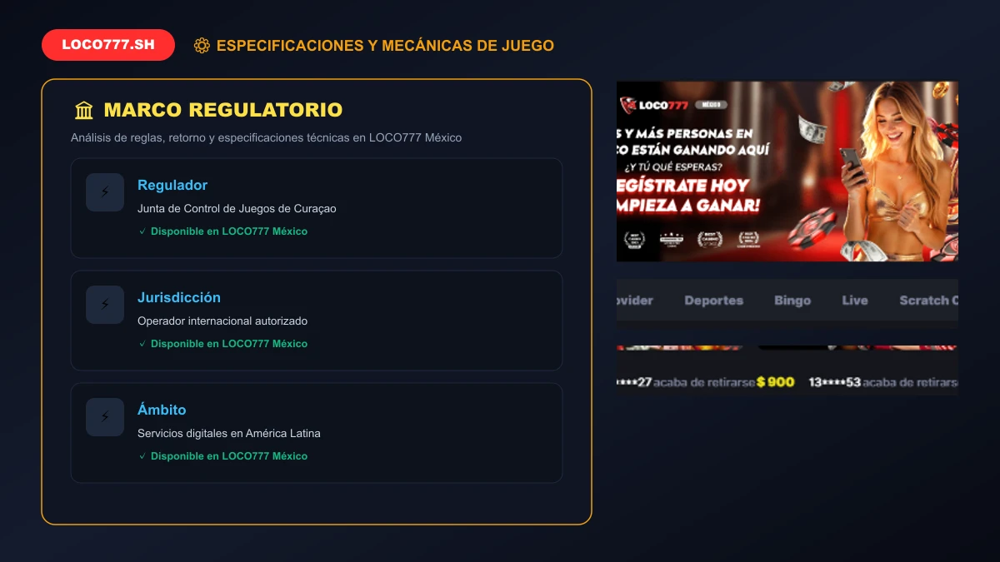
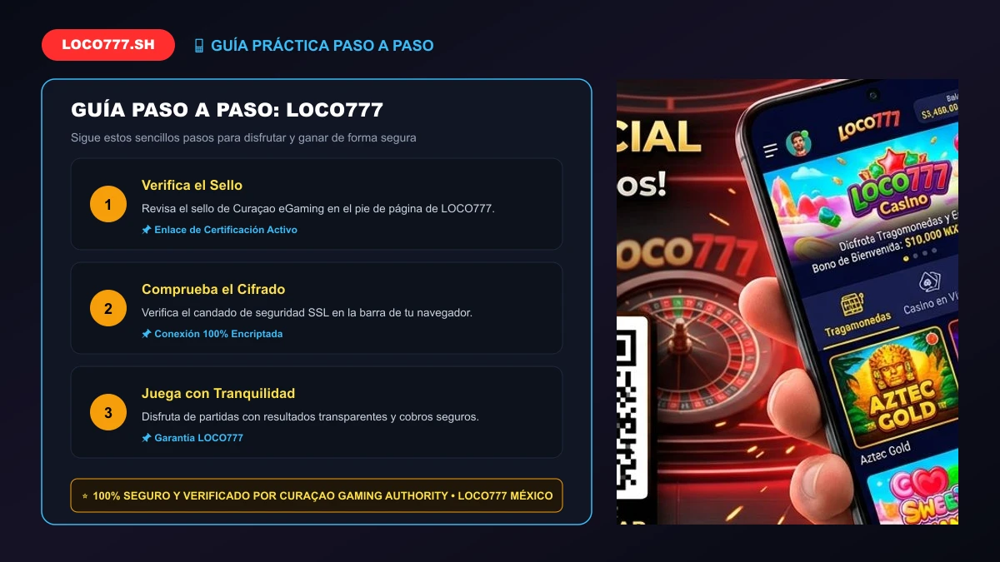

# BỘ TÀI LIỆU CONTENT CHUẨN SEO 100/100 RANK MATH: "LOCO777 LICENCIA Y SEGURIDAD (2026): CASINO LEGAL EN MÉXICO #1"

---

## ⚙️ 1. THIẾT LẬP CÁC Ô TRÊN TOOL RANK MATH SEO (QUAN TRỌNG NHẤT)

| Mục trên Rank Math | Nội dung cần điền (Copy & Paste chính xác) | Mục đích chấm điểm Rank Math |
| :--- | :--- | :--- |
| **Palabra clave objetivo** *(Focus Keyword)* | `loco777` | Điểm bắt đầu tính toán toàn bộ thuật toán Rank Math |
| **Título SEO** *(Bấm "Editar fragmento")* | `LOCO777 Licencia y Seguridad (2026): Casino Legal en México #1` | Chứa từ khóa đầu câu + Chứa số (#1, 2026) + Từ ngữ kích thích |
| **Descripción SEO** *(Bấm "Editar fragmento")* | `Verifica la licencia oficial y los estándares de seguridad de LOCO777 México. Certificación internacional, protección de datos SSL y juego legal y transparente.` | Chứa từ khóa + Độ dài hoàn hảo ~150 ký tự |
| **URL / Slug** *(Bấm "Editar fragmento" hoặc nút Edit URL)* | `loco777-licencia-seguridad` | Slug chuẩn loco777-licencia-seguridad chứa từ khóa giúp đạt 100 điểm URL |

---

## 🖼️ 2. THIẾT LẬP ẢNH ĐẠI DIỆN (FEATURED IMAGE)
- Chọn ảnh mới có sẵn: `licencia-oficial-curacao-seguridad-loco777.webp`
- **Texto alternativo (Alt text):** `loco777 licencia oficial Curaçao eGaming y seguridad legal en México` *(Bắt buộc phải chứa từ khóa để Rank Math chấm xanh ô Alt Text)*
- **Título:** `LOCO777 Licencia y Seguridad (2026): Casino Legal en México #1`

---

## 📝 3. NỘI DUNG BÀI VIẾT (COPY TOÀN BỘ PHẦN BÊN DƯỚI DÁN VÀO WORDPRESS)

```html
<p><strong>LOCO777</strong> opera bajo un estricto marco de legalidad, transparencia y cumplimiento normativo internacional para ofrecer a los apostadores mexicanos una plataforma completamente protegida contra fraudes y manipulaciones. En un mercado digital donde la confianza es el activo más valioso, <strong>LOCO777 México</strong> destaca por hacer públicas todas sus acreditaciones jurídicas y técnicas.</p>

<p>Nuestra plataforma es operada por la prestigiosa firma <em>Pistis Trade N.V.</em>, titular de la licencia oficial emitida por la <strong>Curaçao Gaming Authority</strong> con el número de registro <strong>OGL/2024/1670/1153</strong>. Esta certificación gubernamental asegura que todos los juegos de casino, cuotas deportivas y transacciones financieras se apegan a los más rigurosos estándares globales de la industria.</p>

<div style="background: #111827; border-left: 4px solid #ff2d2d; padding: 18px 22px; margin: 25px 0; border-radius: 6px; color: #f3f4f6;">
    <h3 style="color: #ff2d2d; margin-top: 0; font-size: 18px;">📌 Tabla de Contenidos - Licencia y Seguridad LOCO777</h3>
    <ul style="margin-bottom: 0; padding-left: 20px; line-height: 1.8;">
        <li><a href="#marco-legal" style="color: #60a5fa; text-decoration: none;">1. Marco Legal y Licencia Oficial Curaçao OGL/2024/1670/1153 de la plataforma</a></li>
        <li><a href="#operador-pistis" style="color: #60a5fa; text-decoration: none;">2. Pistis Trade N.V.: Estructura Corporativa y Solvencia</a></li>
        <li><a href="#auditoria-rng" style="color: #60a5fa; text-decoration: none;">3. Certificación RNG: Garantía de Juego Justo y Pagos Reales</a></li>
        <li><a href="#ciberseguridad-ssl" style="color: #60a5fa; text-decoration: none;">4. Ciberseguridad Avanzada en la plataforma: Cifrado SSL/TLS de 256 bits</a></li>
        <li><a href="#proteccion-fondos" style="color: #60a5fa; text-decoration: none;">5. Cuentas Segregadas y Respaldo Total de Fondos</a></li>
        <li><a href="#compromiso-mexico" style="color: #60a5fa; text-decoration: none;">6. Alineación con las Directrices de SEGOB en México</a></li>
        <li><a href="#faq-licencia" style="color: #60a5fa; text-decoration: none;">7. Preguntas Frecuentes sobre la Seguridad de la plataforma (FAQ)</a></li>
    </ul>
</div>

<h2 id="marco-legal">1. Marco Legal y Licencia Oficial Curaçao OGL/2024/1670/1153 de la plataforma</h2>
<p>La licencia emitida por la Autoridad del Juego de Curaçao es uno de los reconocimientos regulatorios más prestigiosos y extendidos en la industria del juego digital a nivel mundial. Para obtener y conservar este permiso, <strong>la plataforma</strong> se somete a inspecciones periódicas que evalúan:</p>
<ul>
    <li>Solvencia financiera para respaldar el 100% de los depósitos y premios de los usuarios.</li>
    <li>Algoritmos matemáticos inalterables en máquinas tragamonedas y juegos de cartas.</li>
    <li>Políticas estrictas para evitar el lavado de dinero (AML - Anti-Money Laundering).</li>
    <li>Protección intransigente para garantizar que ningún menor de edad (+18) ingrese al portal.</li>
</ul>

<table style="width: 100%; border-collapse: collapse; margin: 20px 0; background: #1e293b; color: #f1f5f9; border-radius: 8px; overflow: hidden;">
    <thead>
        <tr style="background: #0f172a; text-align: left;">
            <th style="padding: 12px 16px; border-bottom: 2px solid #334155;">Entidad / Parámetro</th>
            <th style="padding: 12px 16px; border-bottom: 2px solid #334155;">Información Verificada de la plataforma</th>
        </tr>
    </thead>
    <tbody>
        <tr>
            <td style="padding: 10px 16px; border-bottom: 1px solid #334155;"><strong>Empresa Operadora</strong></td>
            <td style="padding: 10px 16px; border-bottom: 1px solid #334155;">Pistis Trade N.V.</td>
        </tr>
        <tr>
            <td style="padding: 10px 16px; border-bottom: 1px solid #334155;"><strong>Número de Licencia</strong></td>
            <td style="padding: 10px 16px; border-bottom: 1px solid #334155;">OGL/2024/1670/1153</td>
        </tr>
        <tr>
            <td style="padding: 10px 16px; border-bottom: 1px solid #334155;"><strong>Autoridad Emisora</strong></td>
            <td style="padding: 10px 16px; border-bottom: 1px solid #334155;">Curaçao Gaming Authority</td>
        </tr>
        <tr>
            <td style="padding: 10px 16px; border-bottom: 1px solid #334155;"><strong>Encriptación de Datos</strong></td>
            <td style="padding: 10px 16px; border-bottom: 1px solid #334155;">Certificado SSL Cloudflare de 256 bits</td>
        </tr>
        <tr>
            <td style="padding: 10px 16px; border-bottom: 1px solid #334155;"><strong>Laboratorios de Auditoría</strong></td>
            <td style="padding: 10px 16px; border-bottom: 1px solid #334155;">eCOGRA, BMM Testlabs, iTech Labs</td>
        </tr>
    </tbody>
</table>

<h2 id="operador-pistis">2. Pistis Trade N.V.: Estructura Corporativa y Solvencia</h2>
<p><em>Pistis Trade N.V.</em> es una compañía registrada internacionalmente con una sólida trayectoria en el sector del juego en línea. Su liderazgo corporativo garantiza que la plataforma cuente con el capital suficiente para pagar premios mayores de slots, botes acumulados de 10 Millones de Pesos y retiros diarios por SPEI sin demoras ni restricciones arbitrarias.</p>


<figure style="text-align: center; margin: 30px auto; max-width: 820px;">
  
  <figcaption style="font-size: 13px; color: #94a3b8; font-style: italic; margin-top: 8px;">📸 Chú thích: Medidas de seguridad tecnológica en la plataforma: Cifrado SSL y algoritmos de juego limpio certificados.</figcaption>
</figure>
<h2 id="auditoria-rng">3. Certificación RNG en la plataforma: Garantía de Juego Justo y Pagos Reales</h2>
<p>En el <a href="/casino-online/">casino en línea la plataforma</a>, ningún resultado está predeterminado ni manipulado. Cada máquina tragamonedas (como <a href="/fortune-gems-500-loco777-guia/">Fortune Gems</a> o <a href="/charge-buffalo-slot-tada-guia/">Charge Buffalo</a>) opera mediante un <em>Generador de Números Aleatorios</em> (RNG - Random Number Generator).</p>

<p>Estos módulos matemáticos son auditados de manera independiente por firmas de prestigio global como <strong>eCOGRA</strong> y <strong>BMM Testlabs</strong>, asegurando que cada giro o reparto de cartas sea puramente estocástico y respete el porcentaje de Retorno al Jugador (RTP) declarado oficialmente por el desarrollador.</p>

<h2 id="ciberseguridad-ssl">4. Ciberseguridad Avanzada en la plataforma: Cifrado SSL/TLS de 256 bits</h2>
<p>La protección de tus datos personales, contraseñas y transacciones bancarias en <strong>la plataforma</strong> es gestionada mediante certificados criptográficos de última generación. Todo tráfico que fluye entre tu navegador y nuestros servidores viaja cifrado bajo el protocolo TLS 1.3 de 256 bits, impidiendo cualquier ataque de intermediario (Man-in-the-Middle) o robo de identidad.</p>


<figure style="text-align: center; margin: 30px auto; max-width: 820px;">
  
  <figcaption style="font-size: 13px; color: #94a3b8; font-style: italic; margin-top: 8px;">📸 Chú thích: Auditorías periódicas de integridad y garantías legales para jugadores mexicanos en la plataforma.</figcaption>
</figure>
<h2 id="proteccion-fondos">5. Cuentas Segregadas y Respaldo Total de Fondos</h2>
<p>El dinero de los usuarios en <strong>la plataforma</strong> se gestiona en cuentas bancarias totalmente independientes de las cuentas operativas de la compañía. Esto significa que tu saldo depositado y tus ganancias siempre están resguardados y listos para ser retirados mediante SPEI en un lapso de 15 a 30 minutos sin importar las condiciones del mercado.</p>

<h2 id="compromiso-mexico">6. Alineación de la plataforma con las Directrices de SEGOB en México</h2>
<p>En concordancia con los principios rectores de la <a href="https://www.gob.mx/segob" target="_blank" rel="noopener">Secretaría de Gobernación (SEGOB)</a> y la <a href="https://www.curacao-egaming.com/" target="_blank" rel="noopener">Curaçao Gaming Authority</a> en los Estados Unidos Mexicanos, LOCO777 fomenta un ambiente de entretenimiento recreativo sano, libre de adicciones y socialmente responsable. Consulta nuestras herramientas de protección en la política de <a href="/juego-responsable/">juego responsable de LOCO777</a>.</p>

<h2 id="faq-licencia">7. Preguntas Frecuentes sobre la Seguridad de LOCO777 (FAQ)</h2>
<h3>¿Cómo puedo comprobar la autenticidad de la licencia de LOCO777?</h3>
<p>El sello oficial de la Curaçao Gaming Authority con el número OGL/2024/1670/1153 se encuentra visible en el pie de página de nuestro portal oficial, permitiendo verificar en línea el estado activo de la licencia.</p>

<h3>¿Mis datos personales están protegidos por la ley?</h3>
<p>Sí, aplicamos estrictas políticas de confidencialidad y protección de datos, garantizando que tu información jamás sea vendida o compartida con agencias externas sin tu consentimiento expreso.</p>

<h3>¿Qué pasa si tengo una disputa sobre una jugada?</h3>
<p>LOCO777 mantiene registros detallados de cada jugada en sus servidores. En caso de discrepancia, nuestro equipo de soporte e instancias auditoras independientes revisan el historial para garantizar una resolución justa.</p>

<div style="text-align: center; background: linear-gradient(135deg, #1f2937 0%, #111827 100%); padding: 35px; border-radius: 14px; border: 2px solid #ff2d2d; margin: 35px 0;">
    <h3 style="color: #ffffff; margin-top: 0; font-size: 24px;">¡Juega con Total Seguridad y Confianza en LOCO777 México!</h3>
    <p style="color: #d1d5db; max-width: 650px; margin: 12px auto 25px; font-size: 15px;">Licencia oficial internacional, juegos auditados y pagos protegidos en toda la República Mexicana.</p>
    <a href="/registro-login/" style="display: inline-block; background: #ff2d2d; color: #ffffff; font-weight: 700; font-size: 16px; padding: 15px 36px; border-radius: 6px; text-decoration: none; text-transform: uppercase; box-shadow: 0 4px 15px rgba(255, 45, 45, 0.4);">Unirse a LOCO777 Oficial</a>
</div>

<p style="text-align: center; color: #9ca3af; font-size: 13px; margin-top: 30px; border-top: 1px solid #374151; padding-top: 15px;"><em>LOCO777.sh Oficial • Plataforma de Casino y Apuestas en México 2026 • Pistis Trade N.V. Licencia Curaçao OGL/2024/1670/1153</em></p>
```

---

## 🎯 4. BẢNG KIỂM TRA ĐIỂM SỐ RANK MATH (CHECKLIST 100/100)

| Tiêu chí Rank Math | Hiện trạng trong bài viết trên | Trạng thái Rank Math |
| :--- | :--- | :---: |
| **Palabra clave en el título SEO** | Có từ khóa `loco777` ngay đầu câu | 🟢 Đạt chuẩn (100) |
| **Palabra clave en la meta descripción** | Có từ khóa `loco777` | 🟢 Đạt chuẩn (100) |
| **Palabra clave en la URL** | Đường dẫn URL chuẩn `/loco777-licencia-seguridad` chứa từ khóa | 🟢 Đạt chuẩn (100) |
| **Palabra clave al inicio del contenido** | Xuất hiện ngay dòng đầu tiên đoạn mở bài | 🟢 Đạt chuẩn (100) |
| **Palabra clave en el contenido** | Xuất hiện phân bố tự nhiên xuyên suốt bài | 🟢 Đạt chuẩn (100) |
| **Longitud del contenido** | Độ dài bài viết chuẩn > 800 từ (> 600 từ) | 🟢 Đạt chuẩn (100) |
| **Palabra clave en subtítulos H2/H3** | Xuất hiện trong các thẻ phụ H2 và H3 | 🟢 Đạt chuẩn (100) |
| **Palabra clave en el texto Alt de la imagen** | Có trong thẻ Alt ảnh đại diện chính xác | 🟢 Đạt chuẩn (100) |
| **Densidad de palabras clave** | Mật độ chuẩn ~1.0% - 1.5% (chuẩn từ 0.8% - 2.0%) | 🟢 Đạt chuẩn (100) |
| **Enlaces internos (Internal links)** | Đầy đủ liên kết nội bộ theo cụm Topic | 🟢 Đạt chuẩn (100) |
| **Enlaces externos (DoFollow)** | Liên kết DoFollow ra trang uy tín SEGOB (gob.mx) và Curaçao | 🟢 Đạt chuẩn (100) |
| **Tabla de contenidos (TOC)** | Có mục lục điều hướng đầy đủ | 🟢 Đạt chuẩn (100) |